# ☀️ Layers of the Sun

The Sun is a massive sphere of hot plasma and is composed of several distinct layers. Each layer has different physical properties such as **temperature, density, pressure, energy-transfer mechanism, and magnetic behavior**.

The layers of the Sun can broadly be divided into two regions:

### Solar Interior

1. Core
2. Radiative Zone
3. Tachocline
4. Convective Zone

### Solar Atmosphere

5. Photosphere
6. Chromosphere
7. Transition Region
8. Corona

The complete structure from the center outward is:

**Core → Radiative Zone → Tachocline → Convective Zone → Photosphere → Chromosphere → Transition Region → Corona**

---

# 1. Core

The **core** is the innermost region of the Sun and is responsible for producing almost all of the Sun's energy.

### Location

Approximately:

`0 – 0.25 R☉`

where `R☉` represents the solar radius.

### Temperature

Approximately:

`15.7 million K`

### What happens in the core?

The enormous temperature, pressure, and density allow **nuclear fusion** to occur.

Hydrogen nuclei ultimately combine to form helium:

`4H → He + Energy`

The dominant fusion mechanism in the Sun is the **proton-proton chain**.

A small amount of mass is converted into energy according to Einstein's equation:

`E = mc²`

Therefore, the core can be considered the **power-generating region of the Sun**.

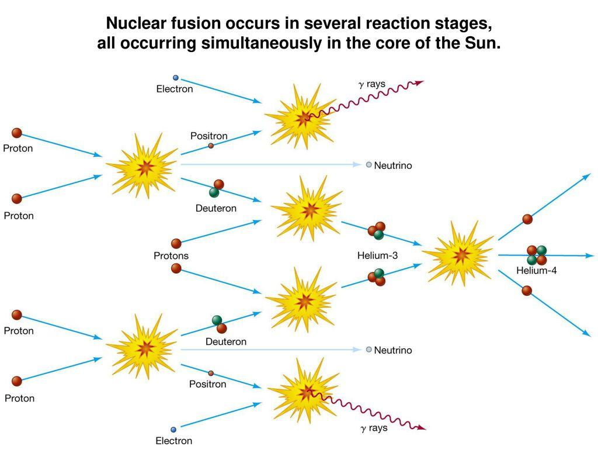

---

# 2. Radiative Zone

The **radiative zone** surrounds the core.

### Location

Approximately:

`0.25 – 0.70 R☉`

### Temperature

The temperature decreases outward from roughly:

`7 million K → 2 million K`

### Energy Transport

Energy is transported mainly through **radiative diffusion**.

Photons generated by processes in the solar interior are repeatedly:

**absorbed → re-emitted → absorbed → re-emitted**

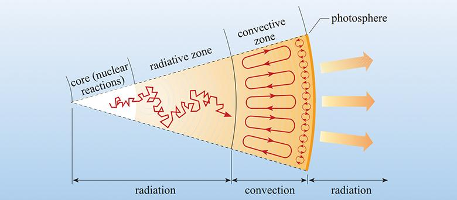


Because photons interact continuously with the surrounding plasma, energy does not travel directly from the core to the surface.

Instead, it undergoes a complicated **random walk** through the solar interior.
It may take thousands to millions of years for photons to pass through this layer.


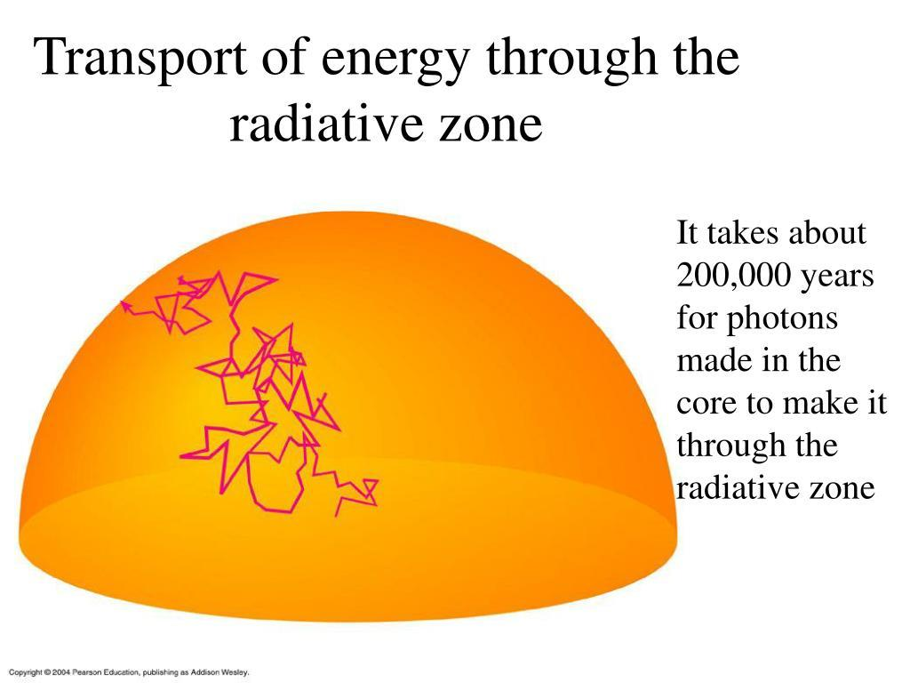

---

# 3. Tachocline

The **tachocline** is a relatively thin region separating the radiative zone from the convective zone.

### Location

Approximately:

`0.70 R☉`

### Why is the tachocline important?

The solar interior and outer layers rotate differently.

The radiative interior rotates approximately like a solid body, whereas the convective zone exhibits **differential rotation**.

This means that different solar latitudes rotate at different angular velocities.

For example, the equatorial regions rotate faster than regions closer to the poles.

This difference produces strong **velocity shear** near the tachocline.

The tachocline is therefore believed to play an important role in the **solar magnetic dynamo**, which generates and reorganizes the Sun's magnetic field.

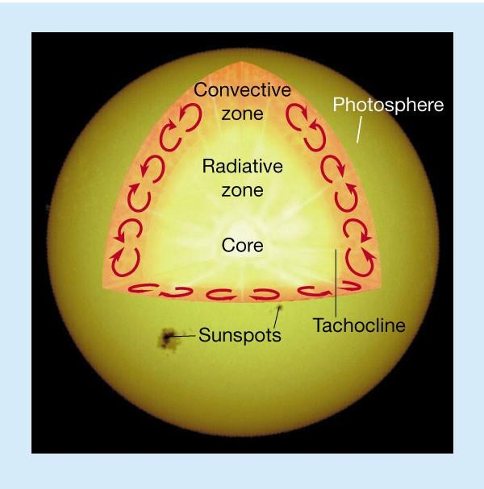

Solar magnetic activity is responsible for phenomena such as:

* Sunspots
* Active regions
* Solar flares
* Solar magnetic cycles

---

# 4. Convective Zone

The **convective zone** forms the outer part of the solar interior.

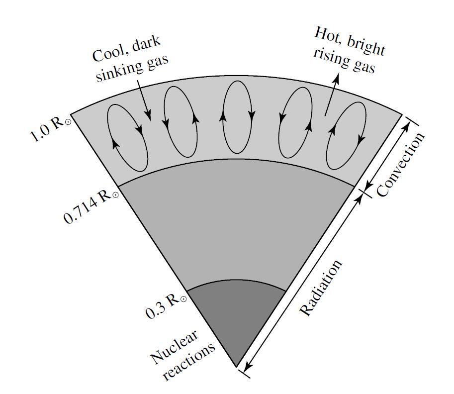

### Location

Approximately:

`0.70 – 1.0 R☉`

It therefore occupies roughly the outer **30% of the Sun by radius**.

### Energy Transport

Energy is primarily transported through **convection**.

Hot plasma rises toward the surface:

`Hot plasma → rises`

After losing energy and cooling, the plasma sinks:

`Cooler plasma → sinks`

This creates large-scale circulating motions known as **convection currents**.

### Granulation

Convection can be observed indirectly on the solar photosphere in the form of **granulation**.

Granules appear as small cellular structures on high-resolution images of the Sun.

Generally:

* **Bright center → hotter plasma rising**
* **Dark boundaries → cooler plasma sinking**

A typical solar granule is approximately **1,000 km across** and survives for only several minutes.

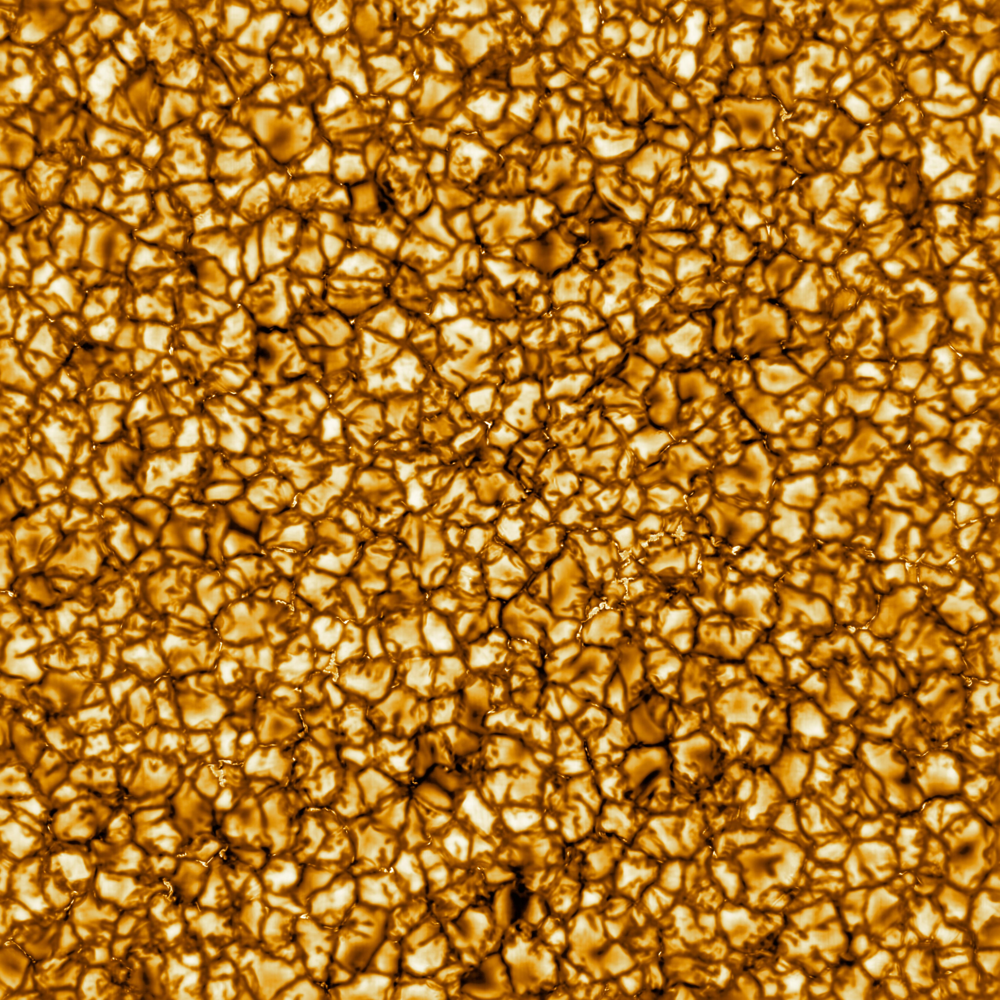

---

# 5. Photosphere

The **photosphere** is commonly referred to as the visible "surface" of the Sun.

However, the Sun does not have a solid surface.

The photosphere is simply the layer from which most of the visible sunlight escapes into space.

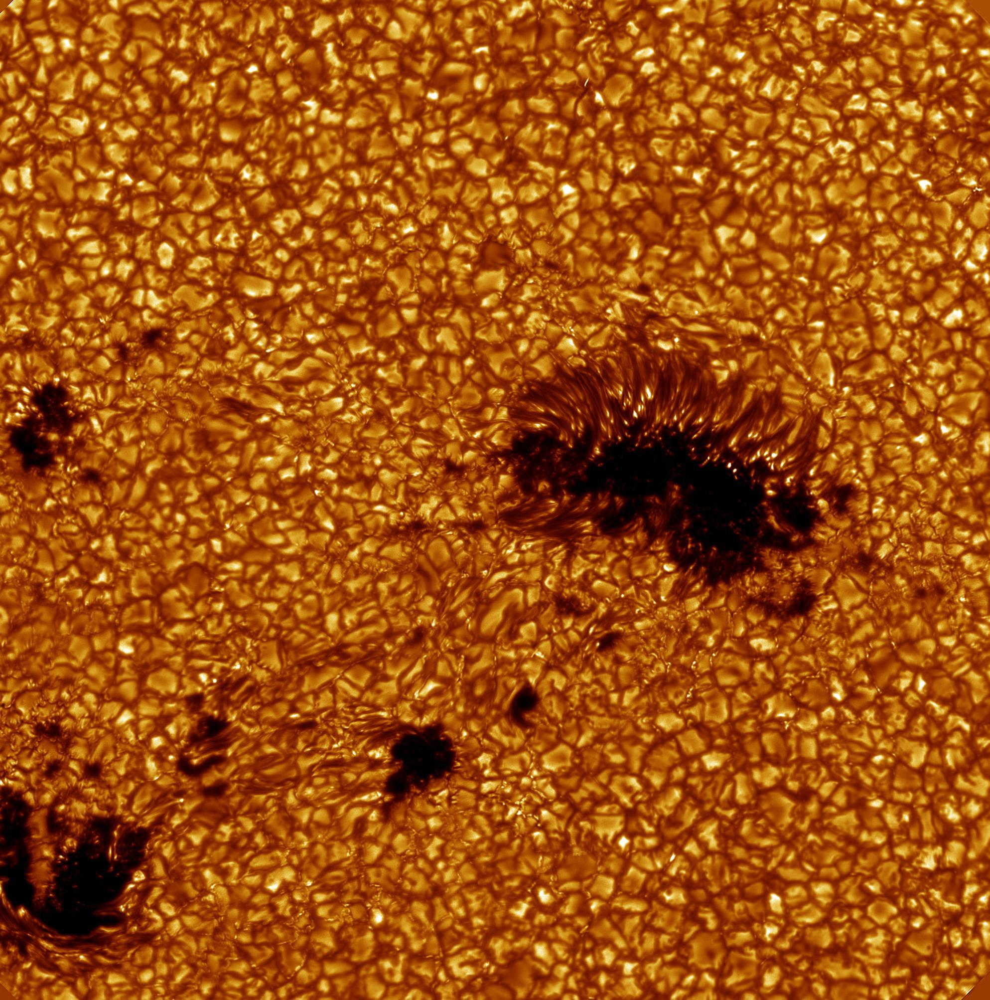


### Temperature

Approximately:

`5770 K`

### Thickness

Only a few hundred kilometers thick.

### Important Features

Several important solar structures are visible in the photosphere:

* Granules
* Sunspots
* Umbra
* Penumbra
* Faculae

## Sunspots

Sunspots are dark regions on the photosphere associated with strong magnetic fields.

A developed sunspot usually consists of two important structures:

### Umbra

The **umbra** is the dark central region of a sunspot.

### Penumbra

The **penumbra** is the lighter, filamentary region surrounding the umbra.

Sunspots appear dark because they are cooler than the surrounding photosphere.

Typical temperatures are approximately:

**Photosphere:** `~5800 K`

**Sunspot Umbra:** `~3500–4500 K`

Strong magnetic fields suppress normal convective energy transport, causing the sunspot region to become cooler.

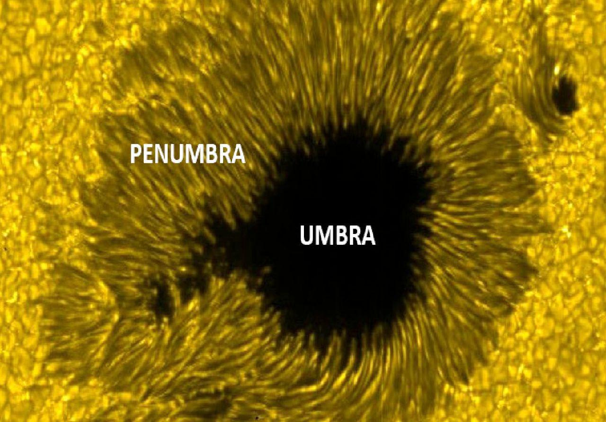

---

# 6. Chromosphere

The **chromosphere** lies directly above the photosphere.

The name approximately means **"sphere of color."**

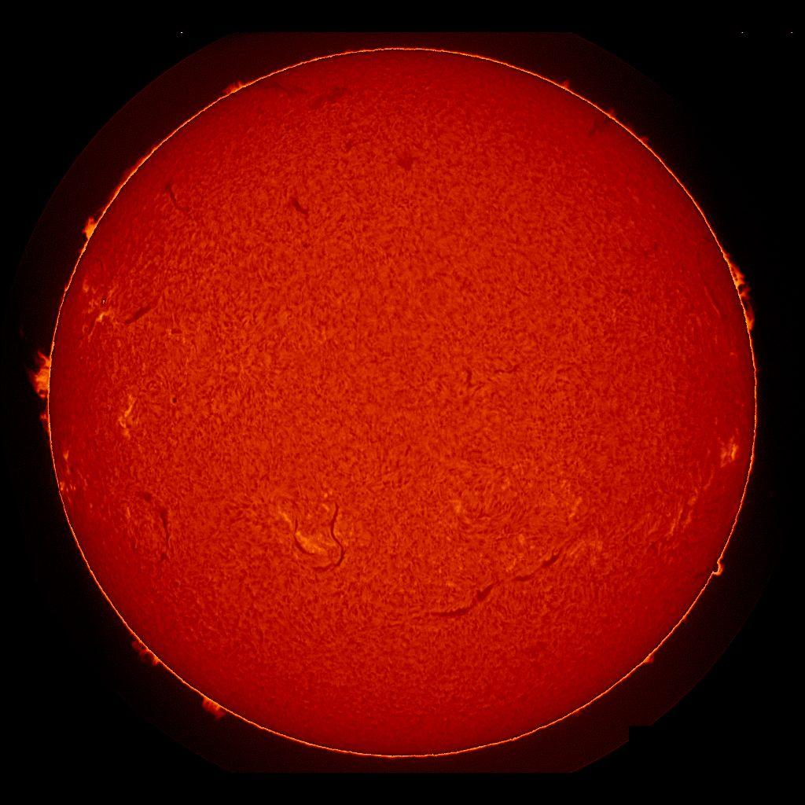

### Thickness

The chromosphere extends several thousand kilometers above the photosphere.

### Temperature

The temperature generally begins increasing with height through the chromosphere.

Approximately:

`~4500 K → 10,000–20,000 K`

### H-alpha Emission

The chromosphere is commonly studied using the hydrogen **H-alpha spectral line**:

`Hα = 656.28 nm`

H-alpha observations reveal many important structures associated with solar magnetic activity.

### Spicules

The chromosphere contains narrow, jet-like structures called **spicules**.

Spicules transport plasma upward through the solar atmosphere and can extend thousands of kilometers above the photosphere.

---

# 7. Transition Region

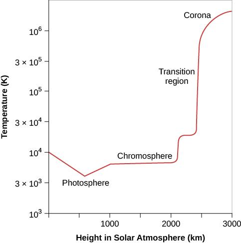

The **transition region** separates the chromosphere from the corona.

It is relatively thin compared with the other solar layers.

The most remarkable property of this region is the extremely rapid increase in temperature.

The temperature increases approximately from:

`~10⁴ K → ~10⁶ K`

over a relatively short distance.

The transition region emits strongly in **ultraviolet (UV)** and **extreme-ultraviolet (EUV)** wavelengths.

---

# 8. Corona

The **corona** is the outermost layer of the Sun's atmosphere.

It extends millions of kilometers into space.

During a **total solar eclipse**, the corona can be observed as a bright white halo surrounding the Sun.

### Temperature

Typical temperatures are:

`~1–3 million K`

Some coronal structures can reach even higher temperatures.

## Coronal Heating Problem

One of the most interesting problems in solar physics is why the corona is dramatically hotter than the photosphere.

The photosphere is approximately:

`5800 K`

while the corona can exceed:

`1,000,000 K`

The mechanisms responsible for this heating are still an active area of solar physics research.

Magnetic processes such as:

* Magnetic reconnection
* Magnetohydrodynamic waves
* Magnetic energy dissipation

are believed to play important roles.

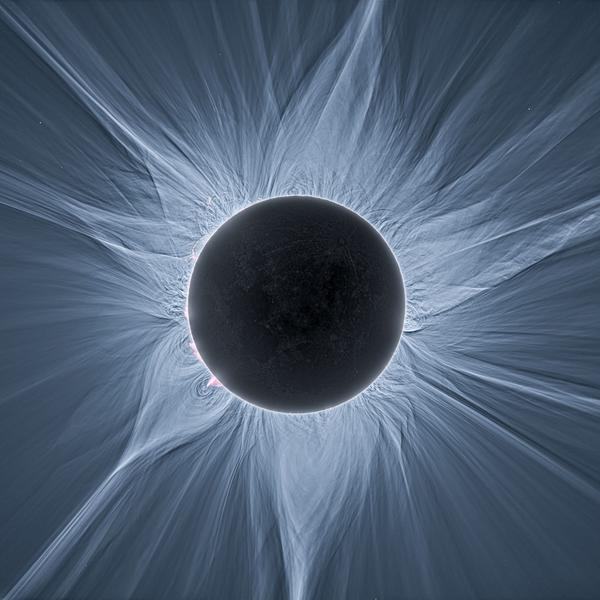

---

# Coronal Loops

The corona is strongly influenced by the Sun's magnetic field.

Hot plasma follows magnetic field structures and produces large arch-like features called **coronal loops**.


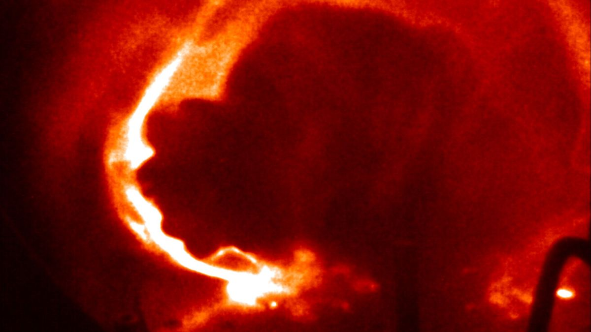

Coronal loops commonly connect regions of opposite magnetic polarity.

They are particularly common above:

* Sunspots
* Active regions
* Magnetically complex regions

---

# Solar Wind

The corona gradually expands outward into space and produces the **solar wind**.

The solar wind consists primarily of charged particles such as:

* Protons
* Electrons
* Alpha particles

These particles travel throughout the Solar System.

When the solar wind interacts with Earth's magnetosphere, it can contribute to:

* Auroras
* Geomagnetic storms
* Space-weather effects

---

# Complete Structure of the Sun

```text
                    SPACE
                      ↑
            ┌─────────────────┐
            │     CORONA      │
            │ ~1–3 million K  │
            └─────────────────┘
                      ↑
              TRANSITION REGION
                      ↑
            ┌─────────────────┐
            │   CHROMOSPHERE  │
            └─────────────────┘
                      ↑
            ┌─────────────────┐
            │   PHOTOSPHERE   │
            │     ~5770 K     │
            │ Visible surface │
            └─────────────────┘
                      ↑
            ┌─────────────────┐
            │   CONVECTIVE    │
            │      ZONE       │
            │   ↑ Hot plasma  │
            │   ↓ Cool plasma │
            └─────────────────┘
                      ↑
                 TACHOCLINE
                      ↑
            ┌─────────────────┐
            │    RADIATIVE    │
            │       ZONE      │
            └─────────────────┘
                      ↑
            ┌─────────────────┐
            │      CORE       │
            │ ~15.7 million K │
            │ Nuclear Fusion  │
            └─────────────────┘
```

---

# Summary

| Layer                 | Approximate Temperature | Main Function / Feature                   |
| --------------------- | ----------------------: | ----------------------------------------- |
| **Core**              |         ~15.7 million K | Nuclear fusion                            |
| **Radiative Zone**    |          ~2–7 million K | Radiative energy transport                |
| **Tachocline**        |            ~2 million K | Rotation shear and solar magnetism        |
| **Convective Zone**   |   ~2 million K downward | Convection transports energy              |
| **Photosphere**       |                 ~5770 K | Visible surface, granulation and sunspots |
| **Chromosphere**      |         ~4,500–20,000 K | H-alpha emission and spicules             |
| **Transition Region** |              ~10⁴–10⁶ K | Rapid temperature increase                |
| **Corona**            |          ~1–3 million K | Magnetic structures and solar wind        |

---

# Important Temperature Trend

The temperature of the Sun does not continuously decrease as we move away from its center.

Initially:

`Core → Radiative Zone → Convective Zone → Photosphere`

the temperature generally decreases.

However, above the photosphere, the temperature begins increasing again:

`Photosphere → Chromosphere → Transition Region → Corona`

Eventually, the corona reaches temperatures of several **million Kelvin**.

Understanding why this happens is one of the major areas of research in modern solar physics.

---

## Key Terms

`Solar Core` `Nuclear Fusion` `Radiative Zone` `Tachocline` `Convective Zone` `Photosphere` `Chromosphere` `Transition Region` `Corona` `Sunspots` `Umbra` `Penumbra` `Granulation` `Coronal Loops` `Solar Wind` `Solar Magnetic Field`


